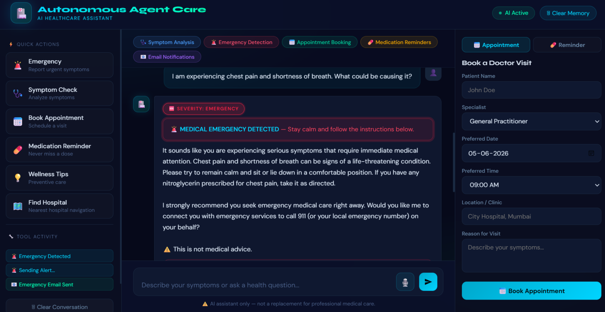

# 🩺 Agentic AI Chatbot for Healthcare Assistance

An AI-powered healthcare assistant designed to provide symptom analysis, emergency detection, hospital recommendations, medication reminders, and voice-enabled interactions to enhance healthcare accessibility and user support.

---

## 📌 Project Overview

Healthcare information and assistance are often difficult to access quickly during emergencies. This project aims to bridge that gap by providing an intelligent healthcare chatbot capable of understanding user symptoms, assessing severity, sending emergency alerts, recommending nearby hospitals, and offering an interactive healthcare experience.

The application combines the power of Large Language Models (LLMs), location-based services, email automation, and voice interaction to create a comprehensive healthcare assistance platform.

---

## ✨ Key Features

* 🔐 Secure user registration with OTP verification
* 👤 User authentication and login system
* 🤖 AI-powered symptom analysis using Google Gemini
* 🚨 Emergency severity detection and classification
* 📧 Automated emergency contact email alerts
* 🏥 Smart hospital finder based on user location
* 📅 Doctor appointment booking interface
* 💊 Medication reminder system
* 🎤 Voice-based symptom input using Web Speech API
* 💬 Chat history storage and retrieval
* ⚡ Real-time AI streaming responses

---

## 📸 Project Screenshots


### Healthcare Chatbot Interface




## 🛠️ Technologies Used

| Layer                | Technology                 | Purpose                                        |
| -------------------- | -------------------------- | ---------------------------------------------- |
| **AI / LLM**         | Google Gemini 2.5 Flash    | Symptom analysis, severity classification, NLP |
| **Backend**          | Python, Flask              | Application logic, routing, APIs               |
| **Streaming**        | Server-Sent Events (SSE)   | Real-time AI response streaming                |
| **Email Automation** | Python smtplib, Gmail SMTP | OTP verification and emergency alerts          |
| **Scheduling**       | APScheduler                | Medication reminder notifications              |
| **Maps**             | Leaflet.js, OpenStreetMap  | Interactive hospital visualization             |
| **Hospital Data**    | Overpass API               | Real-time hospital queries                     |
| **Distance Ranking** | Haversine Formula          | GPS-based hospital ranking                     |
| **Authentication**   | SHA-256, Gmail OTP         | Secure user authentication                     |
| **Database**         | JSON Storage               | User and chat history management               |
| **Frontend**         | HTML5, CSS3, JavaScript    | Responsive user interface                      |
| **Voice Input**      | Web Speech API             | Hands-free symptom reporting                   |

---

## 📂 Project Structure

```text
Agentic-AI-Chatbot-for-Healthcare-Assistance/
│
├── app.py
├── voice_chatbot.py
├── requirements.txt
├── .env.example
├── services/
├── templates/
├── screenshots/
├── users.json
├── history.json
└── README.md
```

---

## ⚙️ Installation and Setup

### 1. Clone the Repository

```bash
git clone https://github.com/24A31A4467/agentic-ai-chatbot-for-healthcare-assistance.git
```

### 2. Navigate to the Project Directory

```bash
cd agentic-ai-chatbot-for-healthcare-assistance
```

### 3. Install Dependencies

```bash
pip install -r requirements.txt
```

### 4. Configure Environment Variables

Create a `.env` file using the `.env.example` template.

Example:

```env
GEMINI_API_KEY=
EMAIL_ADDRESS=
EMAIL_PASSWORD=
```

### 5. Run the Application

```bash
py app.py
```

---

## 🚀 How It Works

1. Users register securely using OTP verification.
2. Users interact with the AI chatbot by entering symptoms through text or voice.
3. Gemini analyzes the symptoms and provides healthcare guidance.
4. The system identifies potentially severe situations.
5. Emergency contacts receive automated email alerts when necessary.
6. Users can discover nearby hospitals using location-aware recommendations.
7. Medication reminders help users stay on track with treatments.

---

## 🔮 Future Enhancements

* 📱 SMS-based emergency alerts
* 🏥 Electronic Health Record (EHR) integration
* 👨‍⚕️ Doctor dashboard for patient monitoring
* ☁️ Cloud deployment for scalability
* 🧠 Fine-tuned domain-specific medical models
* ⌚ Wearable device integration for real-time health monitoring

---

## ⚠️ Disclaimer

This project is intended for **educational and demonstration purposes only**.

The information provided by this application should **not be considered professional medical advice, diagnosis, or treatment**. Users should always consult qualified healthcare professionals regarding medical concerns or emergencies.

---

## 👩‍💻 Author

**Pooja**
B.Tech Data Science Student

GitHub: https://github.com/24A31A4467

---

## 🤝 Contributions

Contributions, suggestions, and feedback are welcome. Feel free to fork the repository and submit pull requests for improvements.

---

## ⭐ Support

If you found this project helpful or interesting, consider giving it a **star** on GitHub.
